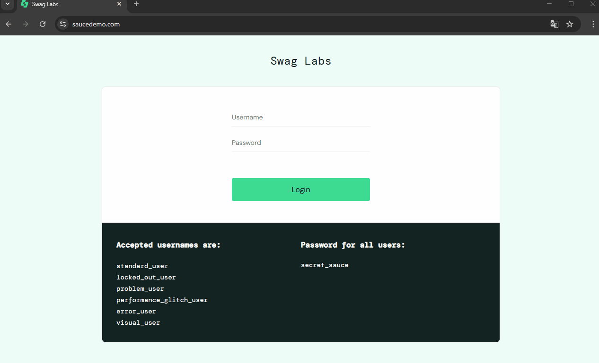
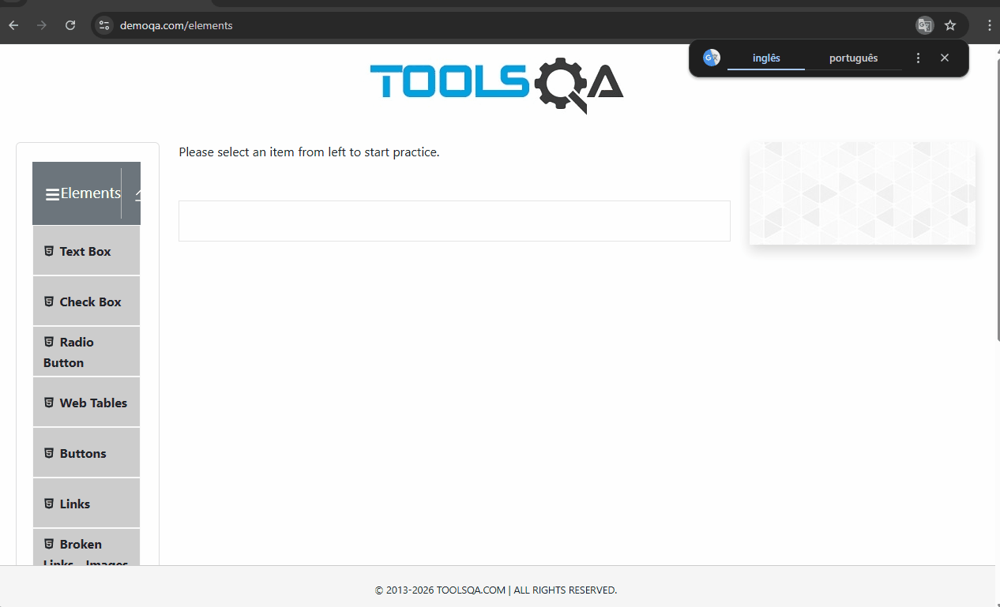
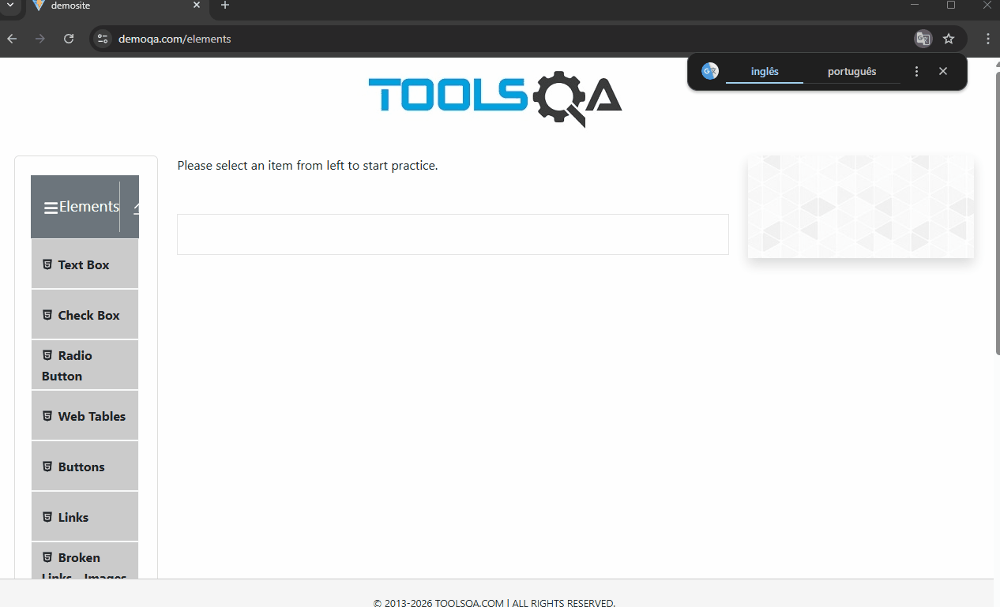
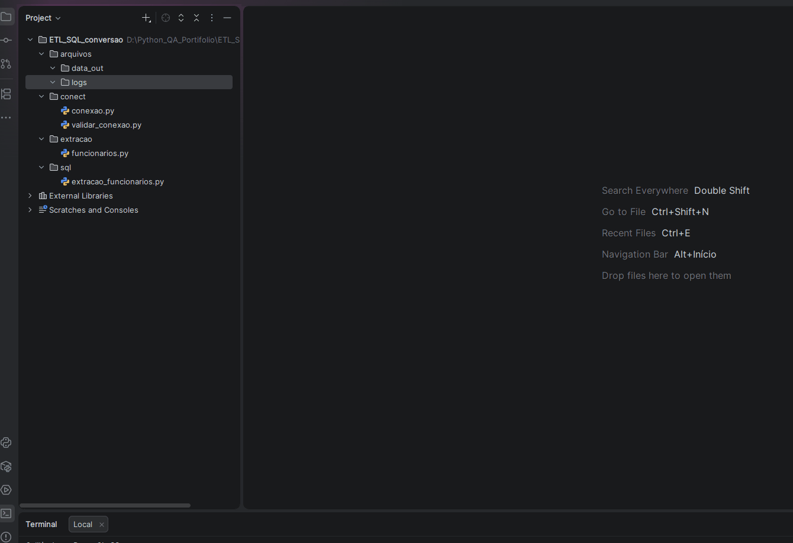

# Portfólio de QA & Engenharia de Dados 

Este repositório contem testes de **Qualidade de Software** de testes automatizados E2E WEB e de  **Conversão de Dados (ETL)**.

## Destaques de Automação Web

### 1. Automação E2E com Playwright & Pytest

Cenários focados em performance, execução paralela e estabilidade.

### A. Demonstração de Teste Compras

### B. Execução de test CRUD

### C. Cadastro e validação das informações

---

## Conversão de Dados - Engenharia de Dados (ETL)

Extração, Organização e alteração de dados

### A. Conversão de dados

---

