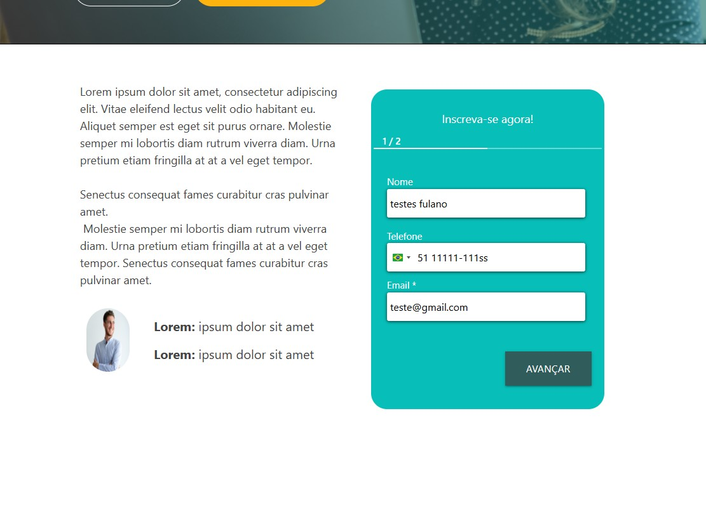
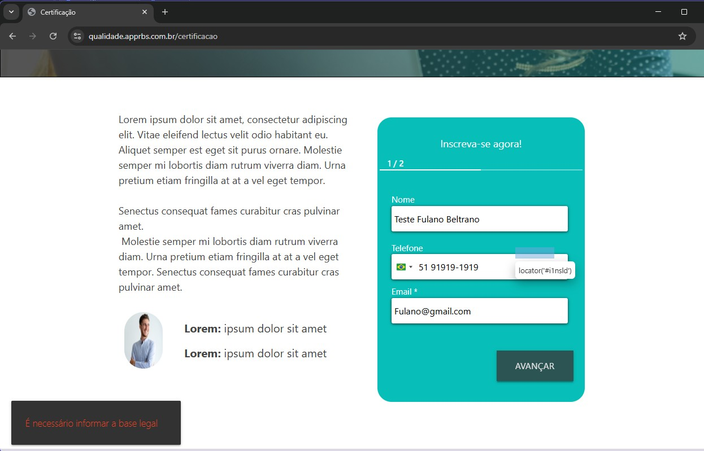
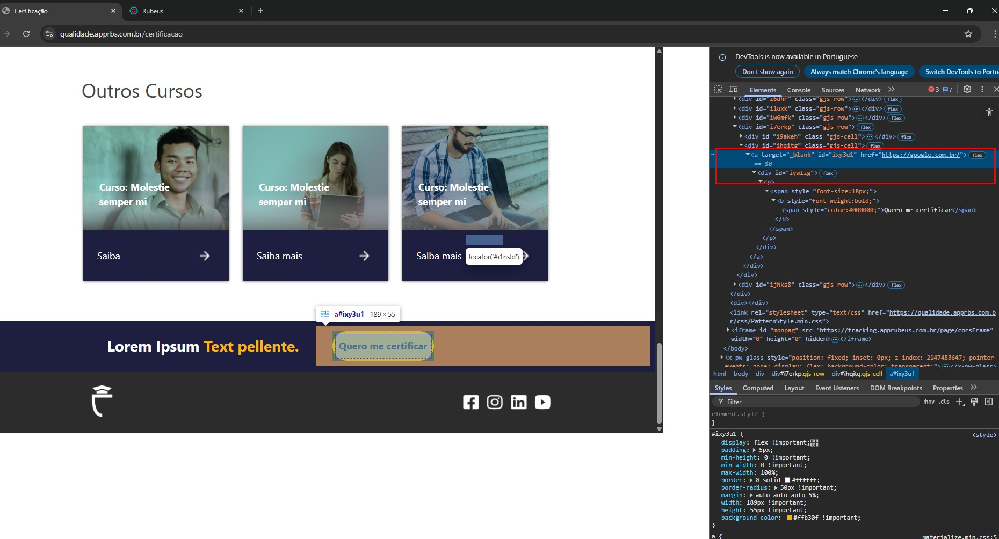
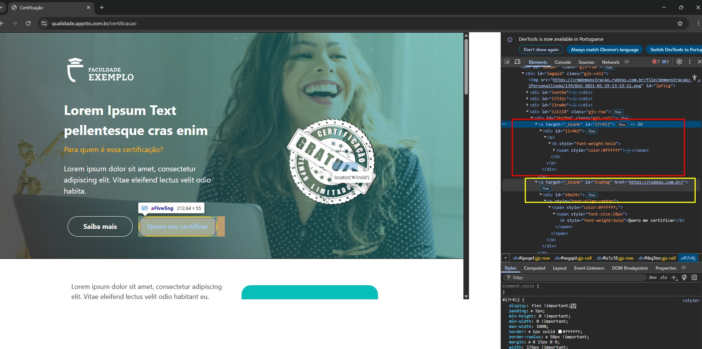
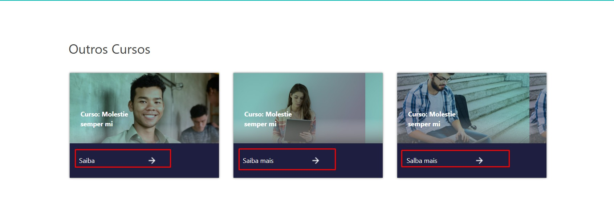
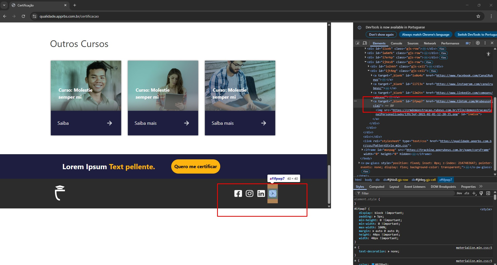
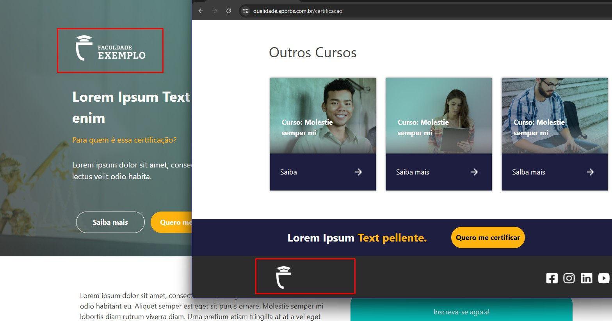

# 🧪 Processo Seletivo – Qualidade Rubeus

## 📌 Objetivo
Realizar avaliação exploratória e funcional das páginas informadas, identificando erros, melhorias e oportunidades de evolução do sistema.

---

# 📋 Itens Identificados

---

## 🐞 Item 01 – Campo Telefone permite caracteres inválidos

**Tipo:** Correção

**Classificação:** Utilidade 

**Prioridade:** Alta  

### 📄 Descrição
O campo "Telefone" permite a inserção de caracteres alfabéticos e quantidade superior ao padrão esperado.

### 🎯 Impacto
Pode gerar armazenamento de dados inconsistentes e comprometer a integridade das informações cadastradas.

### 💡 Sugestão
Implementar validação para permitir apenas caracteres numéricos e limitar a quantidade de dígitos conforme
regra de negócio.

### 🧪 Teste Automatizado
Foi criado teste automatizado cobrindo este cenário:

Caminho:rubeus-qa-test/tests/certificacao/test_cadastro.py
Nome do test: test_inscricao_nao_deve_aceitar_telefone_com_letras

O teste valida o comportamento atual identificado como defeito.

### 📸 Evidência

---

## 🐞 Item 02 – Ao efetuar a Inscrição Mensagem de erro 

**Tipo:** Correção

**Classificação:** Utilidade

**Prioridade:** Alta

### 📄 Descrição
O inserir dados corretos e efetuar o cadastro, o sistema exibe a mensagem: "É necessário informar a base legal".

### 🎯 Impacto
Usuário não efetuar cadastro.

### 🧪 Teste Automatizado
Foi criado teste automatizado cobrindo este cenário:
Caminho:rubeus-qa-test/tests/certificacao/test_inscricao.py
Nome do test: test_inscricao

### 📸 Evidência

---

## 🐞 Item 03 – Botao "Quero me certificar" Rodapé

**Tipo:** Correção  

**Classificação:** Utilidade

**Prioridade:** Alta

### 📄 Descrição
Os botões "Quero me certificar" apresentam links incorretos. O ícone do rodapé, conforme o print, está direcionando
para o Google, enquanto os demais botões levam ao site da Rubeus.

### 🎯 Impacto
Usuário pode confundir o usuario.

### 📸 Evidência

---

## 🐞 Item 04 – "Botão Saiba mais" sem funcionalidade

**Tipo:** Correção  

**Classificação:** Utilidade

**Prioridade:** Média  

### 📄 Descrição
Botão "SAIBA MAIS" não está com link fixado para mais informações

### 🎯 Impacto
Usuário pode ficar frustrado com erro não encontrar as devidas informações.

### 📸 Evidência

---

## 🐞 Item 05 – Erros de digitação na sessão "Outros Cursos"

**Tipo:** Correção  

**Classificação:** Desejabilidade  

**Prioridade:** Média  

### 📄 Descrição
A seção "Outros Cursos" apresenta inconsistências de texto, como:
- "Saiba"
- "Saiba mais"
- "Salba mais"

### 🎯 Impacto
Erros de digitação e inconsistência textual podem comprometer a credibilidade da plataforma e impactar negativamente a experiência do usuário.

### 💡 Sugestão
Padronizar o texto para "Saiba mais".

### 📸 Evidência

---

## 🐞 Item 06 – Melhoria no campo Outros Cursos

**Tipo:** Melhoria

**Classificação:** Desejabilidade

**Prioridade:** Media

### 📄 Descrição
As setas do campo outros cursos não estão vinculadas a nenhum link.

### 🎯 Impacto
Usuário melhorar o marketing para novos clientes

### 💡 Sugestão
Criar paginas modelo para outros cursos

### 📸 Evidência

---

## 🐞 Item 07 – Ajuste ícone rodapé do Youtube

**Tipo:** Melhoria

**Classificação:** Desejabilidade

**Prioridade:** baixa

### 📄 Descrição
No ícone no rodapé Youtube esta com link do Tiktok
ajustar o link correto do youtube ou substituir o ícone para o tiktok

### 🎯 Impacto
Usuário melhorar o marketing para novos clientes

### 💡 Sugestão
Adicionar substituir o ícone do youtube pelo tiktok, ou adicionar tiktok e youtube nio rodapé

### 📸 Evidência

---

## 🐞 Item 08 – Padronizar ícones da faculdade

**Tipo:** Melhoria

**Classificação:** Desejabilidade

**Prioridade:** baixa

### 📄 Descrição
No ícone no rodapé "Simbolo da universidade" não está padronizado com o do cabeçalho

### 🎯 Impacto
Usuário melhorar o marketing para novos clientes

### 💡 Sugestão
Padronizar os ícones simbolo e nome da Faculdade Exemplo, ícone também poderia ser um link para encaminhar o cliente
para pagina inicial 

### 📸 Evidência

---

## 🐞 Item 09 – Sugestão de melhoria na abordagem textual

**Tipo:** Melhoria  

**Classificação:** Desejabilidade  

**Prioridade:** Baixa  

### 📄 Descrição
Alguns textos da página podem ser ajustados para utilizar uma linguagem mais institucional e alinhada ao contexto acadêmico.
Analisar a viabilidade de manter um padrão de alinhamento textual configurado como "Justificado".

Sugestões de melhoria:

- "Para quem é essa certificação?" → "Público-alvo da certificação"
- "Quero me certificar" → "Inscreva-se na certificação"

### 🎯 Impacto
Melhoria na padronização da comunicação e maior alinhamento com o contexto universitário, tornando a apresentação mais formal e didática.

### 💡 Observação
Trata-se de sugestão de aprimoramento da experiência do usuário, não caracterizando erro funcional.

---

## 🐞 Item 10 – Sugestão de melhoria na apresentação da foto

**Tipo:** Melhoria  

**Classificação:** Desejabilidade  

**Prioridade:** Baixa  

### 📄 Descrição
Foto apresentada esta pequena e destorcida

### 🎯 Impacto
Melhoria na padronização da comunicação e maior alinhamento com o contexto universitário, tornando a apresentação mais formal e didática.

### 💡 Observação
Trata-se de sugestão de aprimoramento da experiência do usuário, não caracterizando erro funcional.
