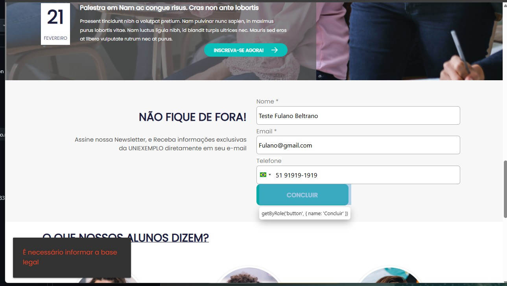
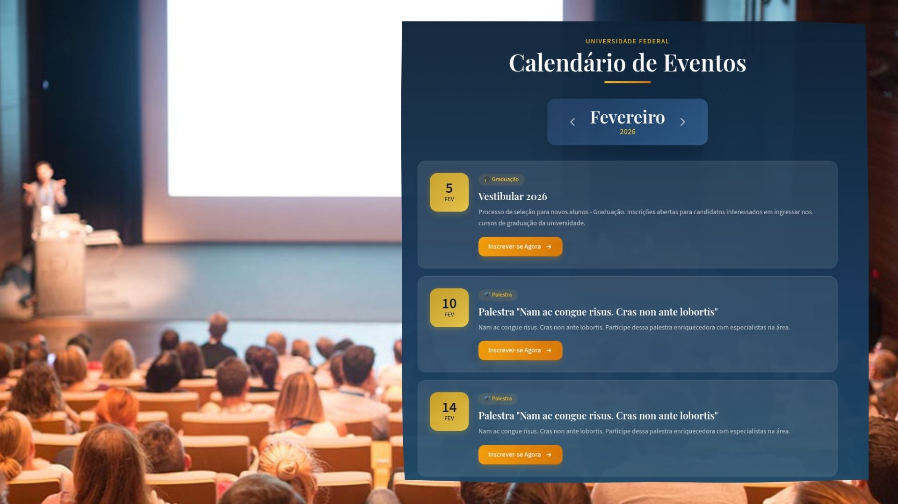
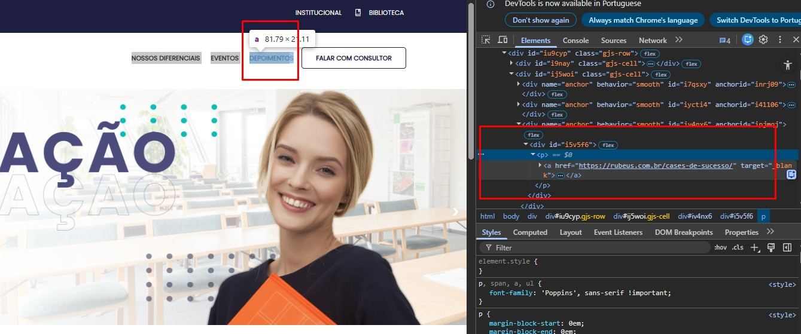
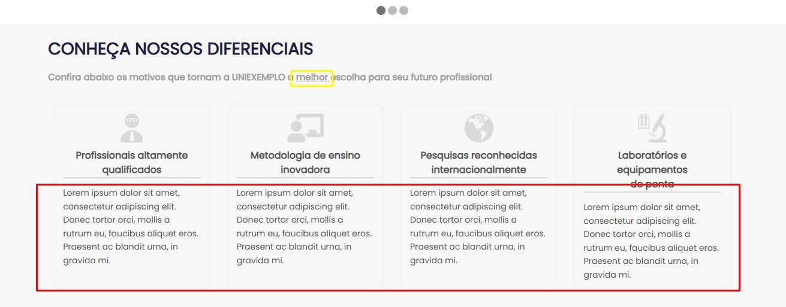
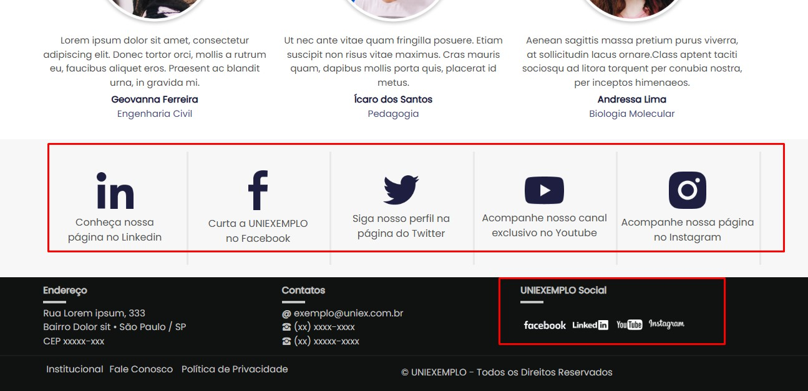

# 🧪 Processo Seletivo – Qualidade Rubeus

## 📌 Objetivo
Realizar avaliação exploratória e funcional das páginas informadas, identificando erros, melhorias e oportunidades de
evolução do sistema.

---

# 📋 Itens Identificados

---

## 🐞 Item 01 – Slides sem funcionalidade de Botões 

**Tipo:** Correção

**Classificação:** Utilidade

**Prioridade:** Alta

### 📄 Descrição

Os botões dos slides abaixos não funcionam.

Os Slides: 

	- Graduação EAD - botão Saiba Mais
	- Graduação Matriculas Abertas - botão inscreva-se
	- Pós-graduação Matricula Abertass - botão inscreva-se

### 🎯 Impacto
Usuário não efetuar cadastro.

---

## 🐞 Item 02 – Cadastro "Newsletter" com erro

**Tipo:** Correção  

**Classificação:** Utilidade

**Prioridade:** Alta

### 📄 Descrição
Ao preencher o cadastro e clicar no Botão "Concluir" sistema apresenta erro 'É necessário informar a base legal'

### 🎯 Impacto
Usuário não irá conseguir efetuar cadastro

### 🧪 Teste Automatizado
Foi criado teste automatizado cobrindo este cenário:
Caminho:rubeus-qa-test/tests/site/test_cadastro.py
Nome do test: test_cadastro

### 📸 Evidência

---

## 🐞 Item 03 – Ajuste no campo "Próximos Eventos"

**Tipo:** Melhoria

**Classificação:** Desejabilidade

**Prioridade:** Alta

### 📄 Descrição

No campo Próximos Eventos, existem diversos itens a serem ajustados:

	- Fundo cinza com letras brancas
	- Calendario 05 fevereiro com Vestibular de 2022
	- Espaço entre data e o mês muito grande
	- Tamanho das letras nas descrições pequenas
	- Botões "Increver-se Agora" não estao alinhados

### 🎯 Impacto
Poluição visual para usuário

### 💡 Sugestão

Ideias para ajustes na print

---

## 🐞 Item 04 – Icones do cabeçalho "NOSSOS DIFERENCIAIS" - "EVENTOS" - "DEPOIMENTO"

**Tipo:** Melhoria

**Classificação:** Desejabilidade

**Prioridade:** Alta

### 📄 Descrição
Ao clicar nos ícones site está abrindo outra página em vez de levar o usuario direto para o campo que se encontra
as informações
 
### 🎯 Impacto
Confusão ao usuario

### 💡 Sugestão
Ajustar os icones para que abrem o campo correto do site. 

### 📸 Evidência

---

## 🐞 Item 05 – Campo "CONHEÇA NOSSOS DIFERENCIAIS"

**Tipo:** Correção  

**Classificação:** Desejabilidade  

**Prioridade:** Média  

### 📄 Descrição

Existe um desalinhamento do item "Laboratorios e equipamentos de ponto".
Ajuste a palavra "Melhor" retirando o sublinhado

### 🎯 Impacto
Visual 

### 💡 Sugestão
Padronizar para que todos icones e Titulos estejam alinhados.
Padronizar as descrições de forma ajuste de texto "Justificado".

### 📸 Evidência

---

## 🐞 Item 06 – Melhoria descrição no campo "Newsletter"

**Tipo:** Melhoria

**Classificação:** Desejabilidade

**Prioridade:** Media

### 📄 Descrição

Na descrição apresenta erros de português e o texto não se apresenta de forma clara.

	NÃO FIQUE DE FORA!

	Assine nossa Newsletter, e Receba informações exclusivas

	da UNIEXEMPLO diretamente em seu e-mail

Padronizar os campos a serem preenchidos: exemplo Nome*, Email* e Telefone não tem *
Botão Concluir esta na cor cinza que dificulta visualização

### 🎯 Impacto
Usuário melhorar o marketing para novos clientes

### 💡 Sugestão

Segue sugestão para novo texto

	Mantenha-se atualizado!
	Assine nossa newsletter e receba conteúdos e informações 
	exclusivas da UNIEXEMPLO diretamente no seu e-mail.

---

## 🐞 Item 07 – Os ícones cabeçalho "Atendimento" E "WhatsApp" 

**Tipo:** Melhoria

**Classificação:** Usuabilidade  

**Prioridade:** Baixa

### 📄 Descrição
Os ícones "Atendimento" E "WhatsApp" acessam o mesmo local.

### 🎯 Impacto
Pode confundir usúario.

### 💡 Sugestão

Ajustar os icones para um só.

---

## 🐞 Item 08 – Repetição de informações sobre redes sociais/Contatos

**Tipo:** Melhoria

**Classificação:** Desejabilidade

**Prioridade:** Baixa

### 📄 Descrição
No final da página do site existe ícones que levam as redes sociais e no rodapé têm os mesmo ícones.
No Rodapé está presenta o link "Fale Conosco" E "Contatos" não existe necessidade de repetir as informações

### 🎯 Impacto

Visual poluido

### 💡 Sugestão
Para melhorar a visualização, retirar os icones do rodapé

### 📸 Evidência

---

## 🐞 Item 09 – Descrição do "O QUE NOSSOS ALUNOS DIZEM?"

**Tipo:** Melhoria

**Classificação:** Desejabilidade

**Prioridade:** Baixa

### 📄 Descrição
Nesta parte do site o Nome do aluno e Formação, devem estar abaixo da foto do Aluno. 

### 🎯 Impacto

Visual poluido e confuso.

### 💡 Sugestão
Dimuniur o texto da descrição e colocá-lo no modo "Justificado"

---
